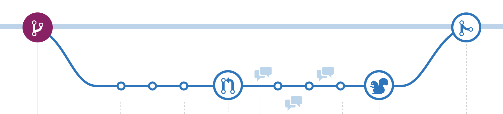

버전 관리 도구는 개발에 있어 거의 필수불가결적인 요소이며, 그중 가장 자주 쓰이는 도구는 단연 Git입니다.
그러나 협업 도구인 만큼, 개개인의 사용 방법이 다르다거나, Git을 제대로 이해하지 못한 채 사용하는 개발자들이 있는 등 실제 운영에는 어려움을 겪는 경우가 많습니다.

이러한 문제를 해결하기 위해 브랜치 전략이 만들어졌습니다.
방법론이 다 그렇듯 만능은 아니지만 어떤 전략이 있고 어떤 특징이 있는지 알아보고자 합니다.

## Git-flow

브랜치 전략을 검색하면 제일 많이 나오는 단어입니다.
[Vincent Driessen이라는 사람이 제안](https://nvie.com/posts/a-successful-git-branching-model/)하였고 가장 널리 쓰이는 전략이 아닐까 싶습니다.

굉장히 복잡해 보이지만, 생각보다 단순합니다.

git-flow는 여러 단계의 branch를 만들어 개발 및 배포 등을 관리합니다.
브랜치의 종류는 크게 `develop`, `feature`, `release`, `hotfix`, `master`로 나누어지며, 각 브랜치의 역할은 다음과 같습니다.

- `feature` 브랜치는 하나의 기능을 개발하기 위한 브랜치입니다. 부모는 `develop`이며, 개발이 완료되면 `develop`에 merge합니다.
  브랜치 이름은 보통 `feature/*`이 됩니다.
- `develop` 브랜치는 개발을 위한 브랜치입니다. 여러 `feature`들이 merge되는 장소이며, 아직 release되지 않은 기능들이 모여 있게 됩니다.
- `release` 브랜치는 배포를 위한 브랜치입니다. `release`는 `develop`에서부터 merge되며, 이후 QA테스트 등을 거쳐 발견된 버그 등은 `release` 브랜치에 커밋합니다.
  버그 픽스를 `release`에서만 하게 되면 `develop`과의 차이가 발생하므로, 해당 부분은 나중에 `develop`에 적용시켜 줄 필요가 있습니다.
- `master` 브랜치는 실제 운영 중인 서비스의 브랜치입니다. `release`브랜치에서 더 이상 문제가 없다고 판단되면 `master`에 merge해 서비스에 적용시킵니다.
  merge 전략에 따라 `master`브랜치에 merge 커밋이 남지 않을 수도 있으므로, Tag를 붙여 릴리스 버전을 관리합니다.
- `hotfix` 브랜치는 서비스에 문제가 발생했을 때 핫픽스에 해당하는 브랜치입니다. 기능 개발(`feature`) 등과 달리 빠르게 대처해야 할 필요가 있기 때문에, `master` 브랜치에 직접 merge하는 전략을 취합니다.
  `release`와 마찬가지로 `develop`과의 차이가 발생하기 때문에, 나중에 차이를 merge할 필요가 있습니다.

### 특징

- 유명한 만큼 쉽게 사용할 수 있게끔 도와주는 도구가 있습니다. Sourcetree에서도 쉽게 구성할 수 있습니다.
- `release`와 `hotfix` 브랜치에 수정된 값은 각각 `develop`과 `master`에 반영될 필요가 있습니다.
  문제는 자동화를 구성하지 않았다면 이런 과정을 잊어버리는 경우가 잦다는 것입니다.
  매 배포 때마다 bug fix같은 작업을 한 뒤 다시 `develop` 등에 반영시키는 것은 굉장히 복잡하고 귀찮은 작업입니다.
  특히 배포 후 문제가 발생해 롤백 할 경우에도..`develop`도 같이 롤백 해야 하니 여간 귀찮은 게 아닙니다.
- `release`와 `master`의 차이점이 조금 애매한 점, 그리고 브랜치가 많이 처음 접한다면 조금 난잡해 보일 수 있습니다.

## Github-flow

[Github의 Scott Chacon이라는 사람이 제안](http://scottchacon.com/2011/08/31/github-flow.html)한 이 전략은, 기존의 git-flow가 복잡하고, Github의 개발 전략과 맞지 않아 새로 만든 전략입니다.

`git-flow`와 달리 굉장히 심플합니다. 배포용 브랜치와 기능을 위한 브랜치로만 구성되어 있습니다.

### 규칙

`github-flow`는 다음과 같은 규칙을 갖습니다.

1. `master`브랜치는 항상 배포가 가능한 상태여야 한다.
2. 새로운 무언가를 작업할 땐 `master`에서 브랜치를 딴다. 브랜치의 이름은 작업에 대한 부가 설명으로 한다.
3. 작업(커밋)은 remote에 푸쉬한다.
4. 피드백이나 도움이 필요하면 Pull request를 작성한다.
5. Accepted되면 `master`에 merge할 수 있게 된다.
6. `master`에 merge하면, 즉시 해당 기능을 배포해야 한다.

### git-flow와의 차이점?

`master`에서 브랜치를 딴다는 개념도 `git-flow`와 다르지만, 사실상의 가장 큰 차이점은 역시 6번의 **즉시 해당 기능을 배포해야 한다**입니다.

서비스 중에는 주기적인 '릴리스'라는 개념이 없는 서비스가 여럿 있습니다. 인스타그램이 대표적인데요, 특정 날에 기능을 몰아서 배포하는 것이 아니고, 기능이 추가되면 그때그때 바로 적용시키는 방법으로 자연스럽게 기능을 추가하고 있죠.
최근엔 이런 식으로 점진적으로 기능을 추가하는 서비스가 많아졌습니다.

이렇게 몰아서 배포할 필요가 없는 환경에서는 `git-flow`의 새 기능을 `develop`에 merge한다는 개념이 불필요합니다. github-flow의 규칙은 이러한 배경을 바탕으로 만들어진 것이라 볼 수 있습니다.

### 특징

- `master`브랜치 하나만으로 운영하므로, `git-flow`에 비해 굉장히 단순한 구조를 갖습니다(= 이해하기가 쉽습니다).
- 기능 장애에 대해 빠르게 대처할 수 있습니다.
  여러 기능이 한꺼번에 배포되는 것이 아니므로, 해당 기능만 롤백 하면 되기 때문입니다.
- 릴리스 개념이 없으므로, 주기적으로 릴리스하려는 회사에게는 맞지 않는 전략입니다.
- 즉시 기능을 배포하기 때문에, 테스트에 조금 더 신경 쓸 필요가 있습니다.
- 이러한 특징 때문에 CI(Continuous Integration)를 잘 구축해 두어야 할 필요가 있으며, 의존성이 높아지게 됩니다.

## 그래서 뭐가 좋아요?
git-flow, github-flow외에도 정말 여러 가지 전략이 있지만(gitlab-flow라던지), 각각 장단점을 갖고 있기 때문에 어느 전략이 무조건 좋다! 같은 정답은 없다고 생각합니다.

제가 재직 중인 회사에서는 2주마다 배포를 진행하도록 스케쥴이 맞춰져 있어 `git-flow`를 도입해 사용하고 있습니다. 그러나 회사의 개발 방침과 조금 다른 부분이 있어, 결국 일부 변형해 사용하고 있습니다(예를 들어 staging을 위한 branch를 추가한다거나 등).

이런 식으로 주기적인 릴리스가 있으면 `git-flow`를 고르고, 릴리스 개념이 없다면 `github-flow`를 고르는 등, 회사의 개발 방침 등을 잘 고려해 적절한 전략을 선택하는 것이 무엇보다 중요하다고 할 수 있겠습니다.
